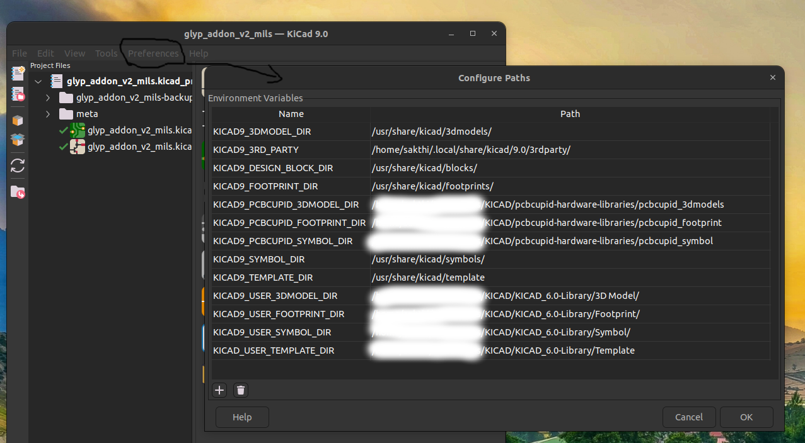
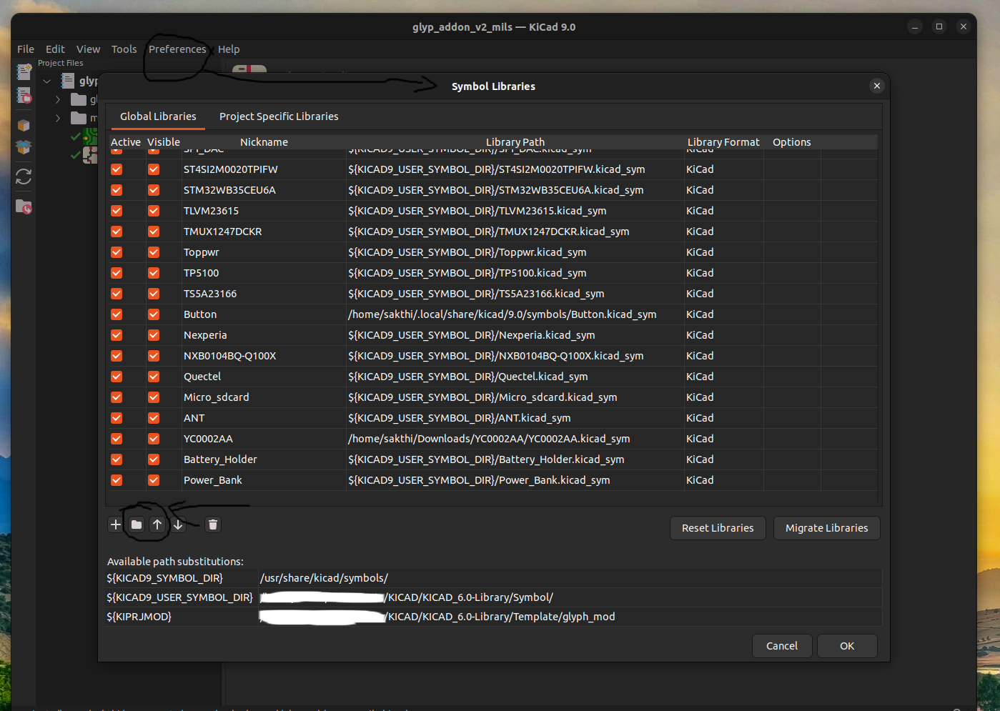
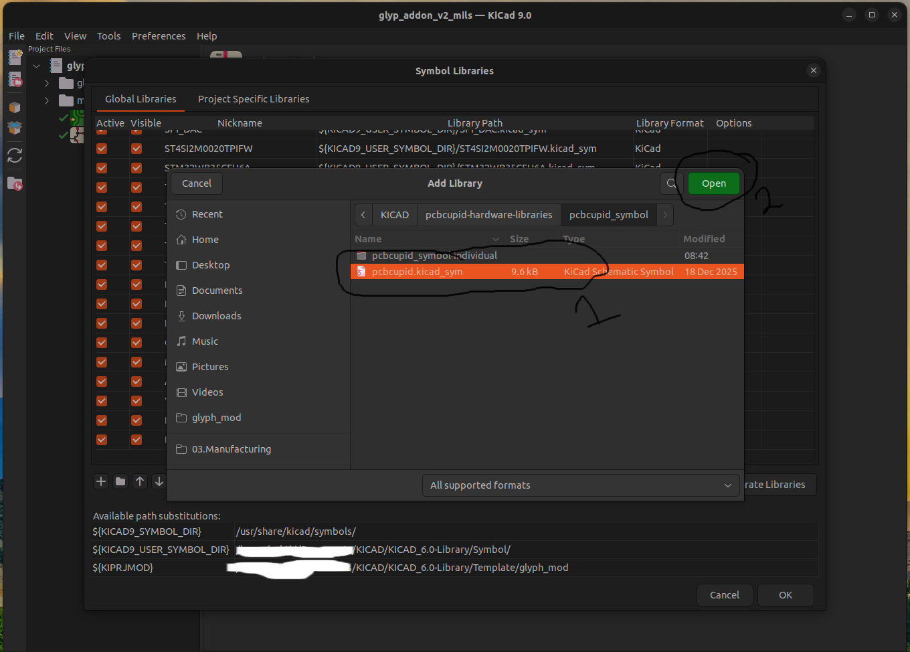
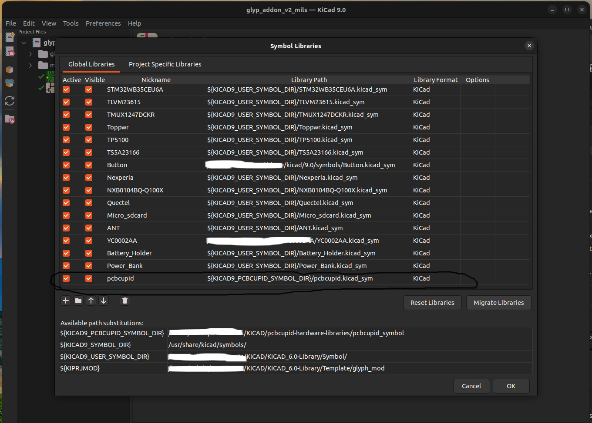
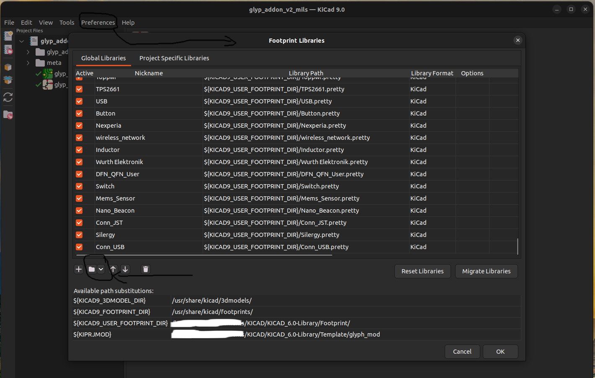
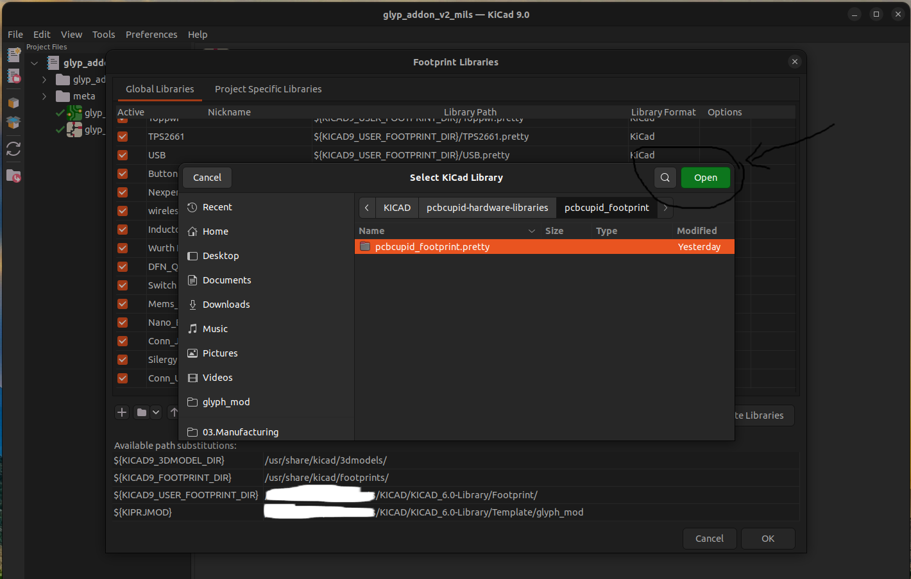

# PCBCupid Library Setup for KiCad

This document describes how to install and configure **PCBCupid custom libraries** for **KiCad 6.0 and newer**.

Once installed **globally**, PCBCupid **symbols, footprints, and 3D models** are available in **all KiCad projects** without additional configuration.

This setup follows **KiCad official library management practices**.

---

## Supported KiCad Versions

- KiCad **6.0 and above**
- Fully compatible with **KiCad 7** and **KiCad 8**

---

## Repository Structure (Release-Ready)

Recommended GitHub repository layout:
```
pcbcupid-hardware-libraries/
│
├── pcbcupid_footprint.pretty/ # PCB footprint library
├── pcbcupid_symbols/ # Schematic symbols (.kicad_sym)
├── pcbcupid_3dmodels/ # 3D models (.step / .wrl)
│
├── docs/
│ └── PCBCUPID_LIBRARY_SETUP_FOR_KICAD.md
│
├── LICENSE
└── README.md
```

> ⚠️ IMPORTANT  
> Do **not rename, move, or reorganize** library folders after configuration.  
> KiCad stores library paths exactly as defined.

---

## Quick-Install Checklist (Recommended)

Use this checklist for a fast and correct setup:

- [ ] Place `pcbcupid-hardware-libraries` in a permanent location
- [ ] Configure global path `PCBCUPID_LIBRARIES`
- [ ] Add footprint library (`.pretty`) to **Global Footprint Libraries**
- [ ] Add symbol library (`.kicad_sym`) to **Global Symbol Libraries**
- [ ] Configure 3D model path `PCBCUPID_3DMODELS`
- [ ] Restart KiCad
- [ ] Verify footprint and 3D model loading

---

## Global Installation (One-Time Setup)

### Step 1: Configure Global Library Base Path (MANDATORY)

KiCad recommends using **path variables** for portable and maintainable libraries.

1. Open **KiCad**
2. Select **Preferences → Configure Paths**
3. Click **Add**
4. Create the following path variable:

| Name | Path |
|----|----|
| `PCBCUPID_LIBRARIES` | Full path to the `pcbcupid-hardware-libraries` folder |

Example internal usage:
```
${PCBCUPID_LIBRARIES}/pcbcupid_footprint.pretty
${PCBCUPID_LIBRARIES}/pcbcupid_symbols
${PCBCUPID_LIBRARIES}/pcbcupid_3dmodels
```

5. Click **OK**
6. Restart KiCad (recommended by KiCad documentation)

---

## Add Libraries to KiCad (Global)

### Step 2: Add Global Footprint Library

1. Open **Preferences → Manage Footprint Libraries**
2. Select the **Global Libraries** tab
3. Click **Add existing library**
4. Select:
```
${PCBCUPID_LIBRARIES}/pcbcupid_footprint.pretty
```
5. Click **OK**

The footprints are now available in all projects.

---

### Step 3: Add Global Symbol Library

1. Open **Preferences → Manage Symbol Libraries**
2. Select the **Global Libraries** tab
3. Click **Add existing library**
4. Select the `.kicad_sym` file located in:
```
${PCBCUPID_LIBRARIES}/pcbcupid_symbols
```
5. Click **OK**

---

## Configure 3D Models (Global)

### Step 4: Define 3D Model Path Variable

KiCad resolves 3D models using **path variables**.

1. Open **Preferences → Configure Paths**
2. Click **Add**
3. Define:

| Name | Path |
|----|----|
| `PCBCUPID_3DMODELS` | `${PCBCUPID_LIBRARIES}/pcbcupid_3dmodels` |

4. Click **OK**

---

## Verify Installation

### Footprint Verification
1. Open **Footprint Editor**
2. Locate a **PCBCupid footprint**
3. Confirm it loads without errors

### 3D Model Verification
1. Open **Footprint Properties → 3D Models**
2. Confirm the model path uses:
```
${PCBCUPID_3DMODELS}/model_name.step/.wrl
```
3. Open **View → 3D Viewer**

---

## Usage in Projects

After global setup:

- Symbols appear in the **Symbol Chooser**
- Footprints appear in the **Footprint Chooser**
- 3D models load automatically in **PCB Editor** and **3D Viewer**

No project-specific configuration is required.

---

## Updating the Libraries

To update PCBCupid libraries:

1. Replace or update the contents of `pcbcupid-hardware-libraries`
2. Keep all configured paths unchanged
3. Restart KiCad

All projects will automatically use the updated libraries.

---

## Troubleshooting

### Footprints Visible but 3D Models Missing
- Verify `PCBCUPID_3DMODELS` path
- Check model file names (case-sensitive on Linux/macOS)
- Restart KiCad

---

### Libraries Not Visible
- Ensure libraries are added under **Global Libraries**
- Verify path variables in **Configure Paths**
- Restart KiCad

---

## Adding Images Later

You may add screenshots using relative paths, for example:

```
docs/images/configure-paths.png
docs/images/manage-footprint-libraries.png
```

Markdown example:









License

See the LICENSE file for usage and distribution terms.

Maintained By

PCBCupid
Custom hardware libraries for KiCad

